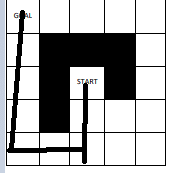
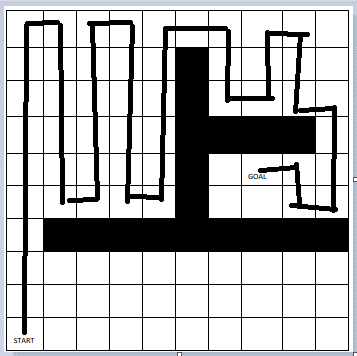
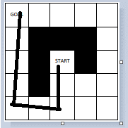
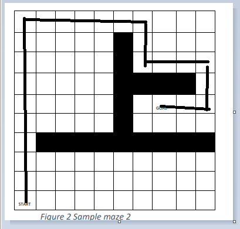
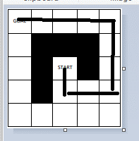
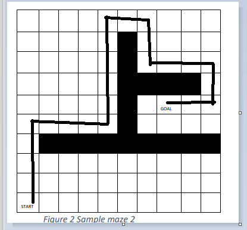

# Prolog-Maze-Solver

Project which uses 3 different path finding approaches, a star search, depth first search and iterative deepening search to solve 2 different mazes.

Below the paths taken by each algorithm can be seen:

# Depth First Search Maze 1

# Depth First Search Maze 2

# Iterative Deepening Search Maze 1

# Iterative Deepening Search Maze 2

# A Start Search Maze 1

# A Start Search Maze 1

